## Testing some image enhancement techniques

This repository is a work in progress and will continue to be expanded and enhanced. It is primarily
intended for practice purposes.

### Color correction
Adjustment of color balance, saturation and hue to achieve natural or desired colors.

### Rectification
Correction of geometric distortions that can be caused by camera lenses or perspective.

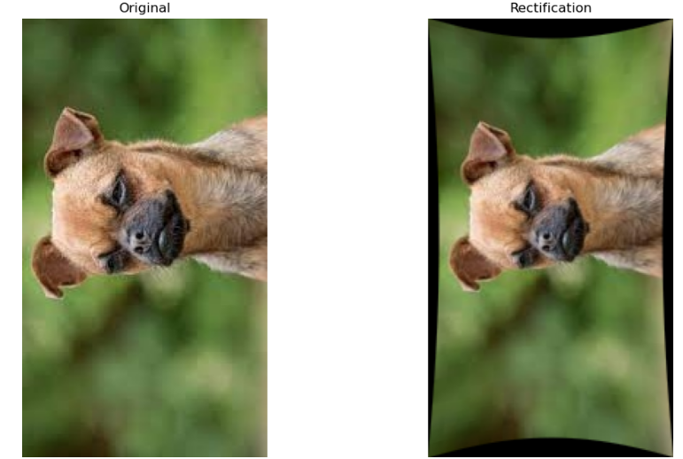

### Deconvolution
Mathematical technique for sharpening images by reversing the blur function

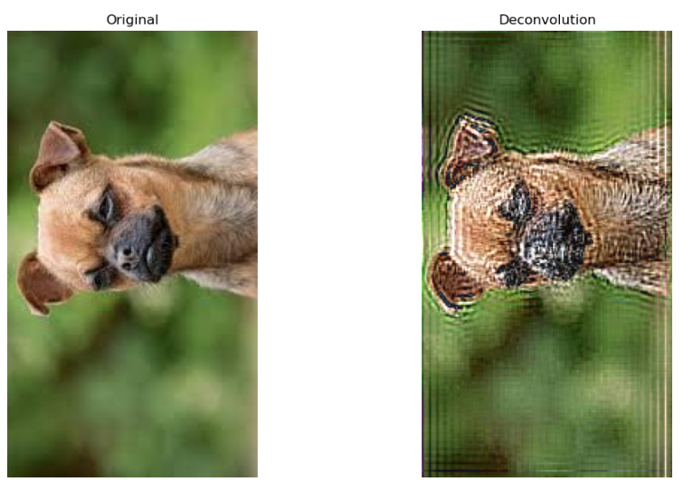

### Super-Resolution
Techniques for increasing the image resolution beyond the original recording resolution.

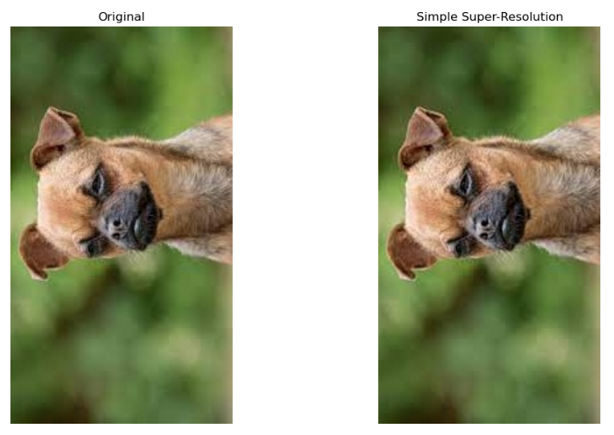

### Image segmentation
Separation of foreground and background or objects in the image for further processing steps

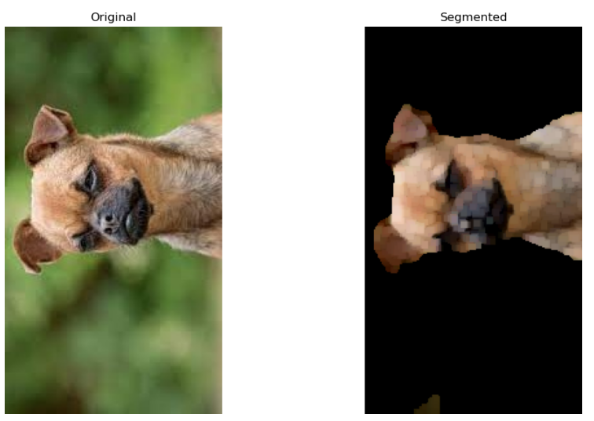

### Histogram equalization

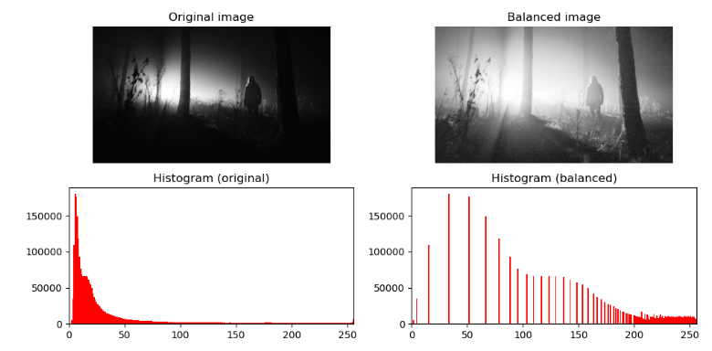

### Global histogram equalization
This is the classic method in which the histogram of the entire image is evenly distributed. It improves the global contrast, but can lead to excessive contrast enhancement in some cases.

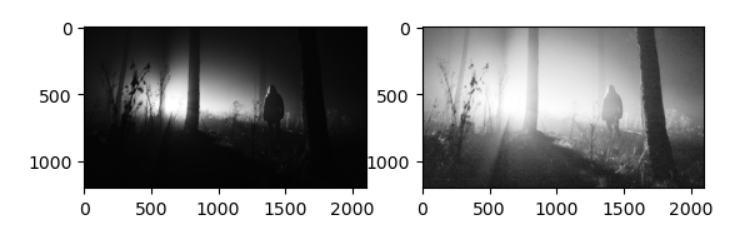

### Adaptive Histogram Equalization (AHE):
This method divides the image into smaller areas (tiles) and applies the histogram equalization to each tile separately. This results in better local contrast enhancement, especially for images with different lighting conditions.

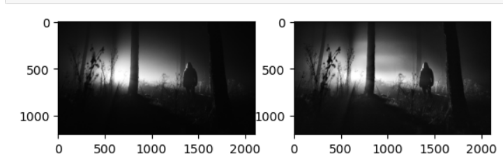

### Contrast Limited Adaptive Histogram Equalization (CLAHE):
An enhancement of AHE that introduces a limit on contrast to reduce over-enhancement and noise amplification

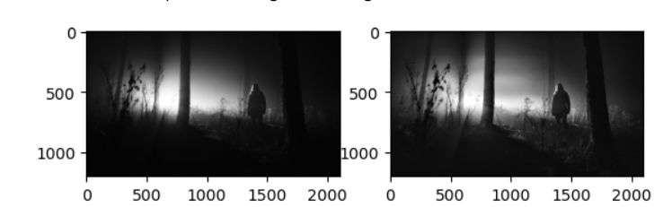

### Histogram stretching:
This technique stretches the histogram over the entire available gray value range. A certain percentage of the darkest and lightest pixels are often mapped to the extreme values.

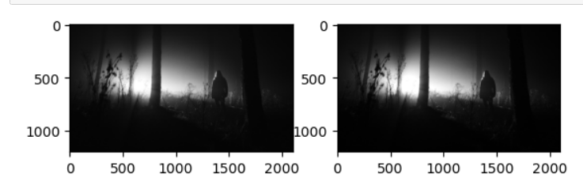

### Histogram shrinking:
This transforms the gray values into a narrower range of values. This can be useful to emphasize certain areas of the image.

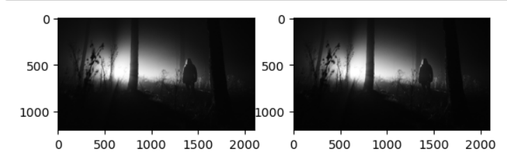

### Piecewise linear histogram transformation:
With this method, different sections of the histogram can be spread or compressed to different degrees.

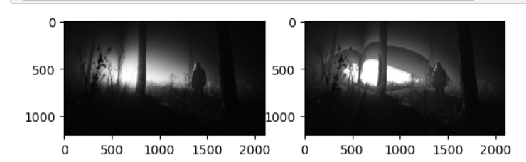

### Histogram limitation:
Here, gray values outside a certain range are mapped to black or white, followed by contrast enhancement in the remaining range.

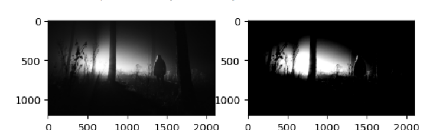
